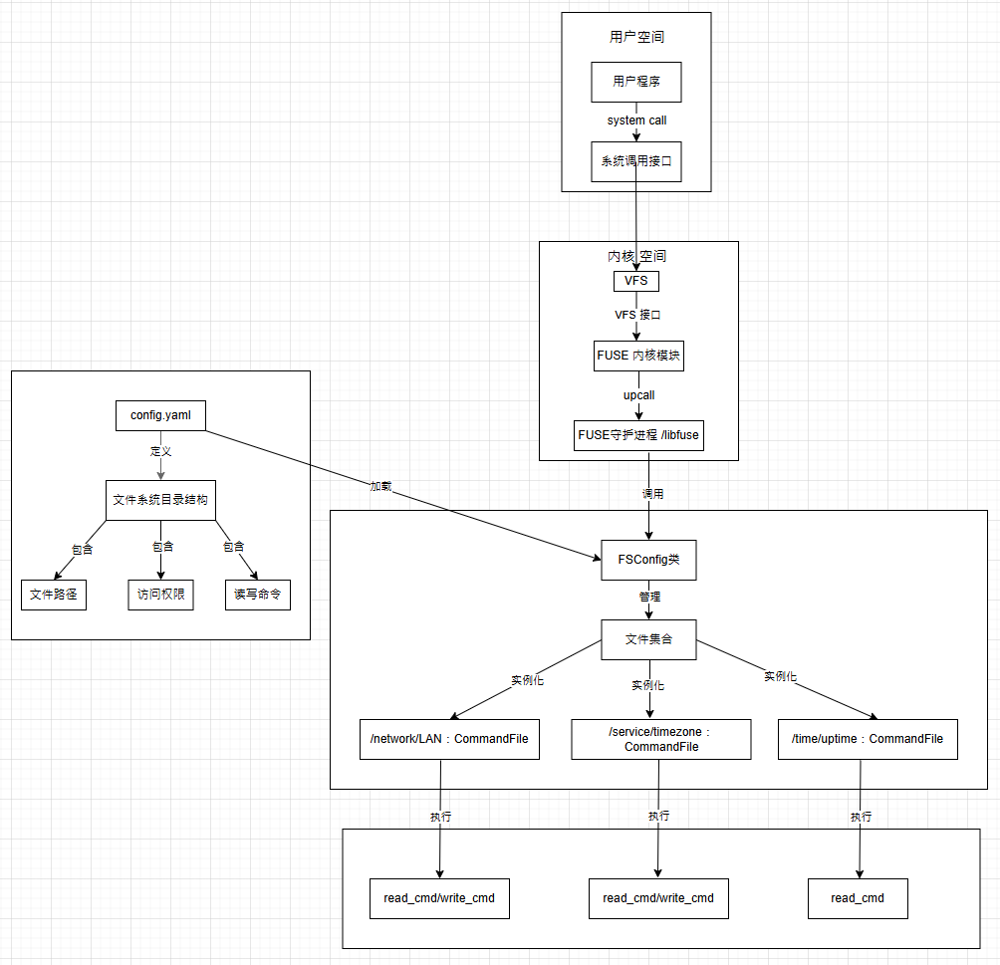
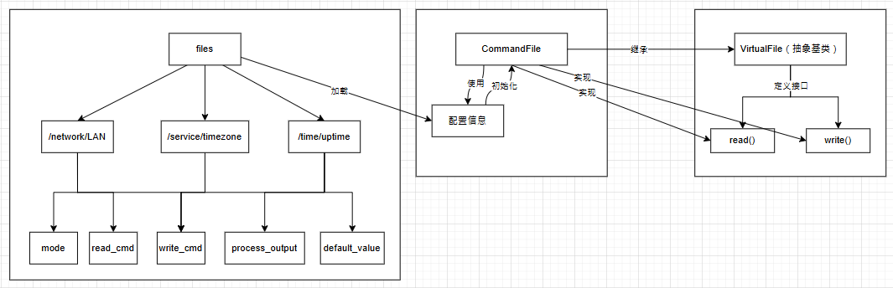
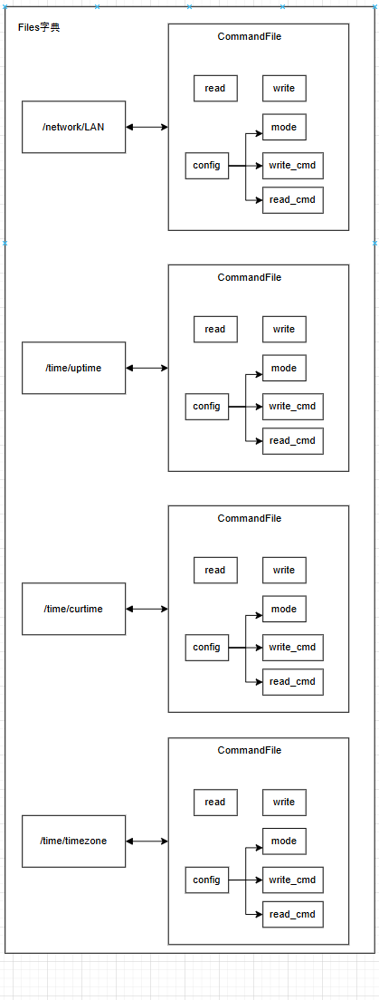
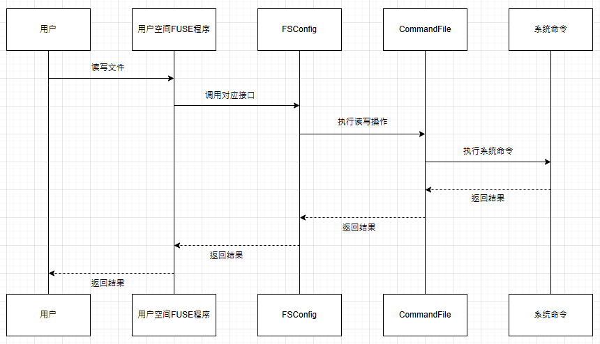
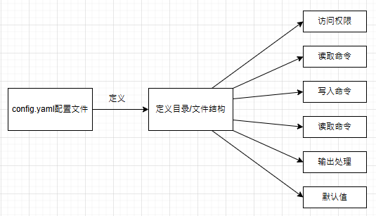

## FUSE 文件系统(ConfigFS)整体设计与实现
### 需求
**实现一个FUSE文件系统，其中包含以下功能：**
- 1.包含`/network/LAN`,`/service/timezone`
- 2.读写`/network/LAN`来获取/设定`enp0s3`的 IP address
- 3.读写`/service/timezone`来获取/设定 TIMEZONE
- 4.考虑扩展性
### 概述
  `ConfigFS` 是一个基于FUSE的虚拟文件系统，用户可通过文件系统接口来读取和设定系统配置(如:IP,TIMEZONE等)。通过配置文件 `config.yaml` ,用户可以配置 `CongfigFS` 的目录结构，文件权限，文件读写等
### 关键组件
1.配置文件（`config.yaml`）:
- 定义文件系统目录结构
- 定义文件权限
- 包含读取命令 `read_cmd` 和写入命令 `write_cmd`
- 包含自定义输出处理 `process_output`,用于处理读取结果
- 包含默认值 `default_value` ，用于读取失败时返回默认值
- 方便扩展

2.虚拟文件类（`VirtualFile`）:
- 抽象基类，定义了读取和写入文件的接口
- 子类 `CommandFile` 继承自 `VirtualFile` ，实现了读取和写入文件的接口
- 接收配置文件信息（ `config.yaml` 中每个文件对应的配置信息）

3.文件系统类（`ConfigFS`）:
- 继承自fuse.operations,包含FUSE文件系统的基本接口，如`getattr,readdir,read,write`等
- 负责加载配置文件，并针对每个文件创建对应的虚拟文件对象(`CommandFile`)
- 实现文件系统操作方法，如`getattr,readdir,read,write`等


| fuse path | mode | content |
| --- | --- | --- |
| /network/LAN | 0666 / R/W | 获取/设置enp0s3的IP地址 |
| /service/timezone | 0666 / R/W | 获取/设置TIMEZONE |
| /time/uptime | 0444/R | 获取系统自启动以来运行时间 |
| /time/curtime  | 0444/R | 获取系统当前时间 |
| /time/timezone | 0666 / R/W | 获取/设置系统当前时区 |











### 具体实现

1.配置文件（`config.yaml`）:
```yaml
files:
  network/LAN:
    mode: 0666
    read_cmd: "nmcli -g IP4.ADDRESS device show enp0s3"
    write_cmd: >
      nmcli device modify enp0s3
      ipv4.method manual
      ipv4.addresses "{value}/24"
      ipv4.gateway "10.0.2.2"
      ipv4.dns "10.180.8.13,10.180.8.12"
    process_output: | # 处理获取的ip地址，移除子网掩码部分 按照'/'分割字符串，取第一个元素
      if '/' in output:
          output = output.split('/')[0]  
    default_value: "0.0.0.0"

  service/timezone:
    mode: 0666
    read_cmd: "timedatectl | grep 'Time zone' | awk -F': ' '{print $2}'"
    write_cmd: "timedatectl set-timezone {value}"
    default_value: "Unknown"
```
2.虚拟文件类（`VirtualFile`）:
```python

class VirtualFile(ABC):
    """虚拟文件基类"""
    def __init__(self, config: Dict[str, Any]): #接收一个字典类型的参数
        self.mode = config.get('mode', 0o666) 
        self.config = config    

    @abstractmethod
    def read(self) -> str:
        """读取文件内容"""
        pass

    @abstractmethod
    def write(self, data: str) -> bool:
        """写入文件内容"""
        pass

```

3.命令文件类（`CommandFile`）:
```python
class CommandFile(VirtualFile):
    """基于命令的配置文件"""
    def read(self) -> str:
        try:
            read_cmd = self.config['read_cmd']
            output = subprocess.check_output(read_cmd, shell=True).decode().strip() #执行read_cmd命令，获取输出内容
            if self.config.get('process_output'):
                # 执行自定义的输出处理
                locals = {'output': output}
                exec(self.config['process_output'], {}, locals) #执行自定义的输出处理，获取output变量'/'之前的内容
                output = locals['output']
            return output + '\n'
        except Exception as e:
            logging.error(f"Read failed: {str(e)}")
            return self.config.get('default_value', 'Error\n')

    def write(self, data: str) -> bool:
        try:
            if 'write_cmd' not in self.config:
                return False
            write_cmd = self.config['write_cmd'].format(value=data.strip()) 
            subprocess.check_call(write_cmd, shell=True) # 执行write_cmd命令，将data的内容写入文件
            return True
        except Exception as e:
            logging.error(f"Write failed: {str(e)}")
            return False

```
4.文件系统类（`ConfigFS`）:

- 配置文件系统
```python

class ConfigFS(Operations):  #继承自Operations类，包含FUSE的基本接口
    def __init__(self, config_path: str):
        self.files: Dict[str, VirtualFile] = {}  #文件路径和文件对象的映射
        self.fd = 0
        self._load_config(config_path)
```
- 从配置文件加载文件系统结构
```python
    # 从配置文件加载文件系统结构，将配置文件中的文件信息加载到self.files字典中，key为文件路径，value为CommandFile对象

    # 从配置文件加载文件系统结构
    def _load_config(self, config_path: str):
       
        try:
            with open(config_path, 'r') as f: 
                config = yaml.safe_load(f) # 读取和解析配置文件 

            for file_path, file_config in config['files'].items():
                if not file_path.startswith('/'):
                    file_path = '/' + file_path
                self.files[file_path] = CommandFile(file_config) # 每个文件对应一个CommandFile对象，方便进行读取和写入

        except Exception as e:
            logging.error(f"Failed to load config: {str(e)}")
            sys.exit(1)
```
- 获取所有目录
```python
    def _get_dirs(self) -> set:  
        """获取所有目录 {'/','/network','/service'}"""
        # 辅助getattr方法，判断是否是目录
        dirs = {'/'}
        for path in self.files.keys():
            parts = path.split('/') # 根据'/'将路径分割为多个部分
            for i in range(len(parts)):
                if i > 0:
                    dirs.add('/'.join(parts[:i])) # 将目录添加到dirs集合中
        return dirs
```

- 获取文件属性
```python
    def getattr(self, path: str, fh=None):
        """获取文件属性"""
        logging.debug(f"getattr: {path}")
        
        st = {
            'st_atime': time(), 
            'st_mtime': time(), 
            'st_ctime': time(), 
            'st_uid': os.getuid(),
            'st_gid': os.getgid() 
        }

        # 目录
        if path in self._get_dirs():
            st['st_mode'] = stat.S_IFDIR | 0o755
            st['st_nlink'] = 2  # 硬链接数，最少为2
            st['st_size'] = 4096
            return st
       
        # 文件
        if path in self.files:
            st['st_mode'] = stat.S_IFREG | self.files[path].mode
            st['st_nlink'] = 1
            st['st_size'] = len(self.files[path].read())  # 获取文件内容的长度，调用CommandFile类的read方法
            return st

        raise FuseOSError(errno.ENOENT)
```

- 读取目录内容
```python
    def readdir(self, path: str, fh) -> list:
        """读取目录内容"""
        logging.debug(f"readdir: {path}")
        
        entries = ['.', '..']
        # 根目录下的子目录
        if path == '/':
            entries.extend(set(p.split('/')[1] for p in self.files.keys())) # 只获取一级目录
        else: # 子目录下的目录和文件
            prefix = path + '/' # 给当前访问的目录加上'/'，如：/network/
            # 筛选以prefix开头的目录和文件，去掉prefix后，再以'/'分割，取第一个元素，得到子目录或文件名
            # 如：/network/LAN -> LAN 
            entries.extend(set(
                p[len(prefix):].split('/')[0]
                for p in self.files.keys()
                if p.startswith(prefix)
            ))
        return entries
```
- 读取文件内容
```python
    def read(self, path: str, size: int, offset: int, fh) -> bytes: #返回bytes类型，而不是str类型，FUSE接口要求
        """读取文件内容"""
        logging.debug(f"read: {path}")
        
        if path in self.files:
            content = self.files[path].read()
            return content[offset:offset + size].encode() # 将字符串转换为字节串
        return b''
```
- 写入文件内容
```python
    def write(self, path: str, data: bytes, offset: int, fh) -> int:
        """写入文件内容"""
        logging.debug(f"write: {path}")
        
        if path in self.files:
            content = data.decode() # 将字节串转换为字符串
            if self.files[path].write(content):
                return len(data)
        return 0
```
- 打开文件
```python
    def open(self, path: str, flags):
        """打开文件"""
        self.fd += 1
        return self.fd  # 返回文件描述符
    
```
### 工作原理
1.加载配置文件：
- `ConfigFS` 类在初始化时读取并解析 `config.yaml` 文件
- 将配置文件中的每个文件路径映射到一个 `CommandFile` 对象，存储在 `self.files` 字典中

2.获取文件属性（`getattr`）:
- 当用户请求文件或目录的属性时，`getattr`方法被调用
- 通过 `_get_dirs` 方法判断路径是否为目录
- 若是目录，设置 `st_mode` 为 `S_IFDIR`, `st_nlink` 为2(.和..)，`st_size` 为 4096
- 若是文件，设置 `st_mode` 为 `S_IFREG`, `st_nlink` 为1, `st_size` 为文件内容长度

3.读取目录内容（`readdir`）:
- 当用户请求目录内容时，`readdir` 方法被调用
- 返回目录的条目列表，包含`.`和`..`
- 对于根目录`/`，返回所有一级子目录（这里的根目录是指挂载点）
- 对于子目录，返回其下的子目录和文件

4.读取文件内容（`read`）:
- 当用户请求文件内容时，`read` 方法被调用
- 调用 `CommandFile` 对象的 `read` 方法执行读取命令
- 根据需要可对读取结果进行处理，再返回结果

5.写入文件内容（`write`）:
- 当用户请求写入文件内容时，`write` 方法被调用
- 调用 `CommandFile` 对象的 `write` 方法执行写入命令
- 将用户提供的数据传递给写入命令，更新系统配置  

### 扩展性
1. 通过配置文件添加新的文件和目录，以及相关文件操作逻辑，无需在原代码中修改，只需在配置文件中添加即可
2. 抽象类设计：使用VirtualFile 抽象基类定义文件的读写接口，通过实现抽象基类的子类，实现具体的文件操作逻辑。后续若新增文件的读写方式改变，只需新增一个 VirtualFile 的子类即可


