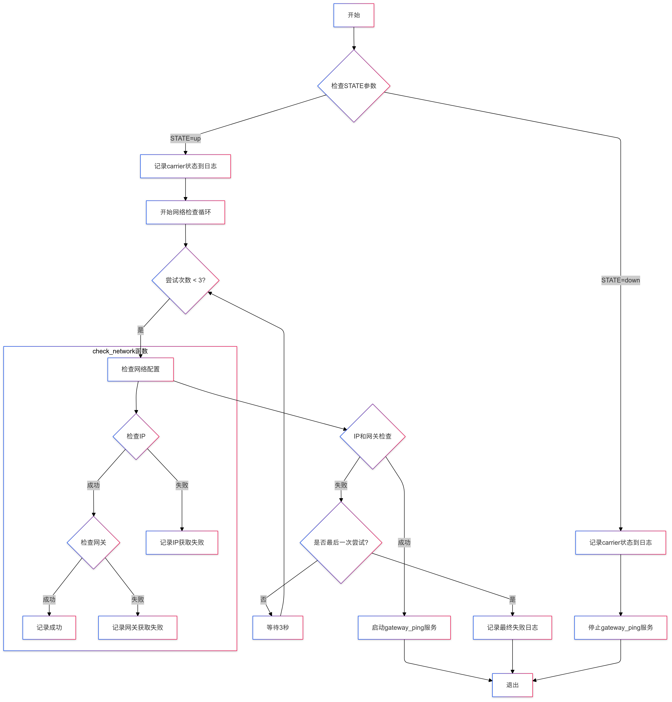

### 1.概述
偵測以太網接口的連接狀態，包括link failure和connection loss
### 2偵測內容
#### 2.1 Link failure 監測
- 定義：ethernet cable是否插入
- 監測原理：通過ifplugd監控carrier狀態
- 監測路徑：/sys/class/net/<interface>/carrier
- 狀態值：0：未連接，1：已連接
#### 2.2 Connection loss 監測
- 定義：網絡層連接狀態
- 監測內容：
    - 1.ip地址分配
    - 2.默認 gateway 分配
    - 3.gateway連通性
- 觸發條件：在Link 狀態為up時進行檢測
### 3. 流程圖

### 3.實現方案
#### 3.1.配置ifplugd，指定監測的網絡接口以及狀態改變時執行的腳本(詳細配置這裡暫不寫出)
腳本內容如下：包含link failure和connection loss兩種情況
```bahs
#!/bin/sh
ETH="$1"
STATE="$2"
MAX_TRIES=3
SLEEP_TIME=3

LOG_PATH="/var/log/ifplugd.log"

start_polling_script() {
    echo "Started gateway ping script for interface $ETH" >> $LOG_PATH
    sudo systemctl start gateway_ping.service
}

stop_polling_script() {
    sudo systemctl stop gateway_ping.service
    echo "Stopped gateway ping script for interface $ETH" >> $LOG_PATH
}

check_network() {
    # 检查IP
    IP=$(ip -4 addr show $ETH | grep -oP '(?<=inet\s)\d+(\.\d+){3}')
    if [ -z "$IP" ]; then
        echo "interface $ETH get IP address failed" >>$LOG_PATH
        return 1
    fi
    echo "interface $ETH got IP address $IP" >>$LOG_PATH

    # 检查网关
    GATEWAY=$(ip route | grep default | awk '{print $3}')
    if [ -z "$GATEWAY" ]; then
        echo "interface $ETH get gateway failed" >>$LOG_PATH
        return 1
    fi
    echo "interface $ETH got gateway $GATEWAY" >>$LOG_PATH
    
    return 0
}

if [ "$STATE" = "up" ]; then
    echo "$(date '+%Y-%m-%d %H:%M:%S') - $ETH : carrier = $(cat /sys/class/net/${ETH}/carrier)" | sudo tee -a $LOG_PATH
    
    # 尝试3次检查网络配置
    for i in $(seq 1 $MAX_TRIES); do
        echo "Attempt $i of $MAX_TRIES checking network configuration..." >>$LOG_PATH
        
        if check_network; then
            start_polling_script
            exit 0
        fi
        
        # 如果不是最后一次尝试，则等待后继续
        if [ $i -lt $MAX_TRIES ]; then
            sleep $SLEEP_TIME
        fi
    done
    
    # 如果3次都失败，记录最终失败日志
    echo "Failed to get proper network configuration after $MAX_TRIES attempts" >>$LOG_PATH
    
elif [ "$STATE" = "down" ]; then
    echo "$(date '+%Y-%m-%d %H:%M:%S') - $ETH : carrier = $(cat /sys/class/net/${ETH}/carrier)" | sudo tee -a $LOG_PATH
    stop_polling_script
else
    echo "$(date '+%Y-%m-%d %H:%M:%S') - Unknown state: $STATE" | sudo tee -a $LOG_PATH
fi
```
#### 3.2 處理邏輯
**1. 腳本接收到ifplugd的狀態改變訊號，並且執行對應的腳本**
**2. Link Failure 檢測：**
```bash
if [ "$STATE" = "up" ]; then
    # 記錄carrier狀態（eth cable 插入）
    echo "$(date '+%Y-%m-%d %H:%M:%S') - $ETH : carrier = $(cat /sys/class/net/${ETH}/carrier)"
    # ... 繼續Connection loss檢測
elif [ "$STATE" = "down" ]; then
    # 記錄carrier狀態（ethernet cable斷開）
    echo "$(date '+%Y-%m-%d %H:%M:%S') - $ETH : carrier = $(cat /sys/class/net/${ETH}/carrier)"
    # 停止网关检测服务
    stop_polling_script
```
**3. Connection Loss 檢測：**
```bash
check_network() {
    # 檢查IP分配
    IP=$(ip -4 addr show $ETH | grep -oP '(?<=inet\s)\d+(\.\d+){3}')
    
    # 檢查默認網關配置
    GATEWAY=$(ip route | grep default | awk '{print $3}')
}

# 在Link UP時進行3次Connection檢測
for i in $(seq 1 $MAX_TRIES); do
    if check_network; then
        # ip與gateway分配成功，则啟動gateway_ping.service(輪詢 ping gateway)
        start_polling_script
        exit 0
    fi
    sleep $SLEEP_TIME  # 3秒間隔
done
```
#### 3.3 腳本執行流程圖

#### 3.4 gateway_ping.service

gateway_ping.service負責執行ping gateway的腳本，並檢測連通性，連通性失敗則寫入日誌通知

```bash
#!/bin/bash

INTERFACE=$1
LOG_FILE="/var/log/gateway_ping.log"

log_message() {
    echo "$(date '+%Y-%m-%d %H:%M:%S') - $1" >> "$LOG_FILE"
}

GATEWAY=$(ip route show default | awk '{print $3}')

while true; do
    if ping -c 1 "$GATEWAY" &> /dev/null; then
        log_message "Gateway $GATEWAY is reachable from interface $INTERFACE"
    else
        log_message "Gateway $GATEWAY is NOT reachable from interface $INTERFACE"
    fi
    sleep 60
done
```


