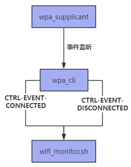

## 1. 工作原理
- wpa_supplicant：是WiFi連接的核心守護進程，負責處理WiFi連接的狀態。
- wpa_cli：是WiFi連接的命令行工具，用於與wpa_supplicant進行通信。
- wpa_cli -a：指定動作腳本
- 當WiFi狀態變化時，wpa_cli會調用動作腳本
## 2.主要事件
- CTRL-EVENT-CONNECTED：wifi連接成功
- CTRL-EVENT-DISCONNECTED：wifi斷開連接

wpa_supplicant 检测到状态变化
    ↓
wpa_cli 接收事件
    ↓
执行动作脚本
    ↓
脚本处理对应事件
## 3.命令
- wpa_cli -i wlan0 -a /usr/local/bin/wifi_monitor.sh
- -i wlan0：指定監控的接口
- -a /usr/local/bin/wifi_monitor.sh：指定狀態變化時執行的腳本
## 4.wifi监控脚本：
```c
#!/bin/bash
# /usr/local/bin/wifi_monitor.sh

# 确保日志目录存在
mkdir -p /var/log/wifi-monitor

log_event() {
    echo "$(date '+%Y-%m-%d %H:%M:%S'): $1" >> /var/log/wifi-monitor/wifi.log
} 

case "$2" in
    "CTRL-EVENT-CONNECTED")
        log_event "WiFi connected - Interface: $1"
        # 启动IP检查脚本，传入接口名称
        /usr/local/bin/gateway_ping.sh "$1" &
        ;;
    "CTRL-EVENT-DISCONNECTED")
        log_event "WiFi disconnected - Interface: $1"
        ;;
esac
```

## 5. gateway连通性检查脚本：
```bash
#!/bin/bash

INTERFACE=$1
LOG_FILE="/var/log/gateway_ping.log"

log_message() {
    echo "$(date '+%Y-%m-%d %H:%M:%S') - $1" >> "$LOG_FILE"
}
   


while true; do
    GATEWAY=$(ip route show default | awk '{print $3}')
    if ping -c 1 "$GATEWAY" &> /dev/null; then
        log_message "Gateway $GATEWAY is reachable from interface $INTERFACE"
    else
        log_message "Gateway $GATEWAY is NOT reachable from interface $INTERFACE"
    fi
    sleep 30
done
```
## 6.集成系统服务systemd
```c
# /etc/systemd/system/wifi-monitor.service

[Unit]
Description=WiFi Connection Monitor
After=network.target wpa_supplicant.service

[Service]
ExecStart=/usr/sbin/wpa_cli -i wlan0 -a /usr/local/bin/wifi_monitor.sh
Restart=always
RestartSec=10

[Install]
WantedBy=multi-user.target
```

## 7.部署
### 设置执行权限
- chmod +x /usr/local/bin/wifi_monitor.sh
- chmod +x /usr/local/bin/check_ip.sh

### 创建日志目录
- mkdir -p /var/log/wifi-monitor
- chmod 755 /var/log/wifi-monitor

### 启用并启动服务
- systemctl daemon-reload
- systemctl enable wifi-monitor
- systemctl start wifi-monitor