----
    theme: white.css
    width: 960
    height: 700
    minScale: 0.2
    maxScale: 1.5
    controls: true
    transition: 'slide'
    mouseWhee: 'true'
----


----
marp: true
----

# 目录
- 编译过程概览
- 准备工作
- 预处理
- 编译
- 汇编
- 链接
----
# 编译过程概览

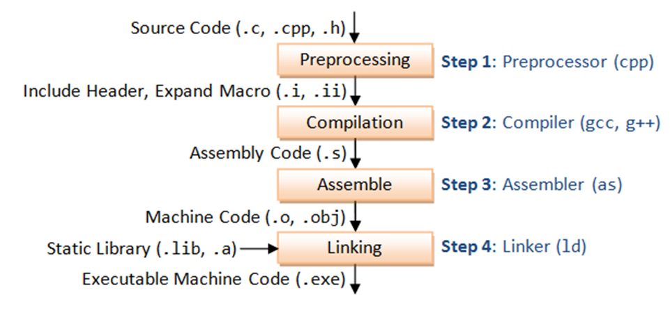

----

# 准备工作
**编译工具：GCC(GNU Compiler Collection)，包含GCC、Binutils、C运行库等**
**Binutils**：一组二进制程序处理工具，包括：ar、objdump、as、ld、ldd、readelf、size等

----

|工具|作用|
|---|---|
|ar|主要用于创建、修改以及从静态库中提取文件|
|objdump|主要功能是将二进制代码转换为汇编代码|
|as|主要用于汇编。它将汇编语言源代码（.s文件）转换成机器语言的目标代码（.o文件）|
|ld|链接器|
|ldd|列出可执行文件或共享库所依赖的其他共享库|
|readelf|用于查看ELF（Executable and Linkable Format）格式文件的信息，如文件头、段（section）信息、符号表等。|


----

**演示代码**：
```
#include <stdio.h>
#define VAR 1

int main()
{
    int b=VAR;
    printf("hello world!\n");
    return 0;
}
```
----
# 预处理(Pcreprocessing)
## 命令：
```gcc -E hello.c -o hello.i```

## 主要过程:
- 移除#define指令，替换所有的宏定义，并且根据条件预编译指令(如#if、#ifdef、#ifndef等)包含或排除相应的代码段
- 处理#include预编译指令，将被包含的文件插入到该预编译指令的位置
- 删除所有注释("//"和"/* */")
----
## 查看hello.i文件
**命令：cat hello.i**
```
//hello.i代码片段
extern void funlockfile (FILE *__stream) __attribute__ ((__nothrow__ , __leaf__));

# 885 "/usr/include/stdio.h" 3 4
extern int __uflow (FILE *);
extern int __overflow (FILE *, int);
# 902 "/usr/include/stdio.h" 3 4
# 2 "hello.c" 2
# 5 "hello.c"

int main()
{
 int a=1;
 printf("hello world!\n");
 return 0;
}
```
----
<!--
_class: lead gaia
_paginate: false
-->


----

# 编译(Compilation)
> 将经过预处理之后的.i文件进行一系列的语法分析、语义分析及代码优化后生成相应的汇编代码
## 命令
```gcc -S hello.i -o hello.s```
## 主要任务
- 词法分析：将源代码分割成一系列的标记，如关键字、标识符、运算符等
- 语法分析：根据语法规则来分析由词法分析生成的标记序列，构建一颗语法树。这棵树表示了程序的语法结构
- 语义分析：检查语义正确性，包括类型检查、作用域检查等
- 代码优化：对代码进行多种优化，提高程序的执行效率

----

## 查看hello.s文件

```
//hello.s代码片段

main:
.LFB0:
	.cfi_startproc
	endbr64
	pushq	%rbp
	.cfi_def_cfa_offset 16
	.cfi_offset 6, -16
	movq	%rsp, %rbp
	.cfi_def_cfa_register 6
	subq	$16, %rsp
	movl	$1, -4(%rbp)
	leaq	.LC0(%rip), %rax
	movq	%rax, %rdi
	call	puts@PLT
	movl	$0, %eax
	leave
	.cfi_def_cfa 7, 8
	ret
	.cfi_endproc
```

这段代码的主要作用是：在栈上创建一个新的栈帧，初始化一个整型局部变量，准备并调用puts函数来打印一个字符串，然后清理栈帧并返回0
注：栈帧是函数调用过程中在调用栈（call stack）上开辟的空间，用于存放函数执行时的各种信息。每个函数调用都会创建一个新的栈帧，并在函数返回时销毁该栈帧。

----

# 汇编(Assembly)
> 汇编过程实际上指把汇编语言代码翻译成目标机器指令的过程，这一步产生的文件叫做目标文件，是ELF(Executable and Linkable Format)格式的可重定向文件。


## 指令
``` gcc -c hello.s -o hello.o```

## 主要任务
- 翻译汇编指令：汇编器(Binutils中的as)读取汇编代码，并将其中的每一条汇编指令翻译成对应的机器指令。这些机器指令是计算机硬件能够直接识别和执行的低级代码。
- 地址分配：在汇编过程中，汇编器还会为程序中的变量、函数等分配内存地址。这些地址在程序运行时用于访问和操作相应的数据或执行相应的函数。
----
## ELF的文件格式
- ELF文件（Executable and Linkable Format）是一种用于二进制文件、可执行文件、目标代码、共享库的标准文件格式。主要用于Linux平台。
- 组成：ELF头、程序头表、段头表、具体的段
- 两种视图：链接视图和执行视图，链接视图是以节，执行视图是以段为单位

- 链接视图：主要用于链接过程，即编译器和链接器在处理目标文件以生成可执行文件或共享课文件时所使用的的视图

- 执行视图：以段为单位组织和查看elf文件，主要用于程序执行时，系统加载器将文件内容加载到内存中所使用的的视图
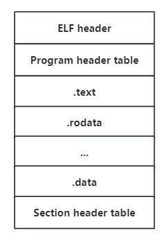](https://terenceli.github.io/assets/img/elf/2.png)

- ELF header：描述了整个ELF文件的基本属性。指出section header table和program header table在文件的位置
- program header table，这个是从运行的角度来看ELF文件的，主要给出了各个segment的信息
----
- .text：已编译程序的指令代码段。

- .rodata：ro代表read only，即只读数据。

- .data：已初始化的C程序全局变量和静态局部变量。

- .bss：未初始化的C程序全局变量和静态局部变量。

- .debug：调试符号表，调试器用此段的信息帮助调试。
- .symtab：一个符号表（symbol table），它存放程序中被定义和引用的函数和全局变量的信息
- section header table，这个保存了所有的section的信息
----
## 查看hello.o文件
> hello.o目标文件为ELF格式的文件，不能当做普通文本文件打开

**1.readelf:显示 ELF（Executable and Linkable Format）文件信息的工具**
**2.objdump:用于显示二进制文件信息。可以显示反汇编代码、符号表、重定位表等**

----
**查看符号表：readelf -s hello.o**   
```
Symbol table '.symtab' contains 6 entries:
   Num:    Value          Size Type    Bind   Vis      Ndx Name
     0: 0000000000000000     0 NOTYPE  LOCAL  DEFAULT  UND 
     1: 0000000000000000     0 FILE    LOCAL  DEFAULT  ABS hello.c
     2: 0000000000000000     0 SECTION LOCAL  DEFAULT    1 .text
     3: 0000000000000000     0 SECTION LOCAL  DEFAULT    5 .rodata
     4: 0000000000000000    41 FUNC    GLOBAL DEFAULT    1 main
     5: 0000000000000000     0 NOTYPE  GLOBAL DEFAULT  UND puts
```
----
Num:符号编号，用于唯一标识符号
Value:对于函数和变量，这通常是它们在内存中的地址(在对象文件中，这通常是相对于段的偏移量)。在对象文件中，由于最终的内存地址尚未确定，这些值通常为0
Size:符号的大小(以字节为单位)
Type:符号的类型(FUNC、OBJECT、FILE、SECTION、NOTYPE)
Bind:符号的绑定属性(指示符号的可见性和作用域)
	LOCAL:符号在定义它的内部可见
	GLOBAL:符号在程序的所有部分都可见
	WEAK:弱符号，类似于全局符号，在链接时优先级较低
Vis:符号的可见性，通常与Bind字段一起使用
	DEFAULT:默认的可见性
	PROTECTED:受保护的可见性
	HIDDEN:隐藏的符号，在链接时不会被其他文件看到
	INTERNAL：内部符号，仅在当前编译单元内可见
Ndx:符号所在的段索引，未定义的外部符号通常是UND，对于特殊符号(如FILE和SECTION)可以是ABS或其他特殊值
Name:符号的名称

----

**查看代码段：objdump -d hello.o**

```
hello.o:     file format elf64-x86-64
Disassembly of section .text:
0000000000000000 <main>:
 //PC地址  指令编码              指令的汇编格式
   0:	f3 0f 1e fa          	endbr64 
   4:	55                   	push   %rbp
   5:	48 89 e5             	mov    %rsp,%rbp
   8:	48 83 ec 10          	sub    $0x10,%rsp
   c:	c7 45 fc 01 00 00 00 	movl   $0x1,-0x4(%rbp) //初始化局部变量
  13:	48 8d 05 00 00 00 00 	lea    0x0(%rip),%rax        # 1a <main+0x1a>
  1a:	48 89 c7             	mov    %rax,%rdi
  1d:	e8 00 00 00 00       	call   22 <main+0x22>  //函数调用
  22:	b8 00 00 00 00       	mov    $0x0,%eax
  27:	c9                   	leave  
  28:	c3                   	ret

```
注：这段汇编代码表示了main函数的执行流程，包括堆栈初始化、局部变量初始化、函数调用准备，最后返回0

----

# 链接(Linking)
> 将编译生成的目标文件(.o 文件)与库文件等组织起来，形成最终的可执行文件
## 静态链接(Static Link)
### 原理：
在编译时期，链接器将程序所需的库文件(如标准库、第三方库等)的内容复制到可执行文件中，合并成一个单独的可执行文件。在这个过程中，链接器会解析目标代码中的符号引用(函数名、全局变量名等)，将库文件中的代码和数据直接复制到可执行文件中，替换原来的符号引用。

----

### 步骤
**1.地址空间分配**
链接器首先扫描所有输入的目标文件，收集它们的段信息，然后根据一定的策略（如按序叠加或相似段合并）将相同性质的段合并到一起。在合并的过程中，链接器为这些段分配虚拟地址，并建立映射关系。
**2.符号解析：**
确保程序中引用的所有符号(如函数和变量)都能正确找到它们的定义
**3.重定位：**
链接器（Linker）将多个编译后的目标文件（.o 文件）合并成一个可执行文件时的一个重要步骤。重定位的目的是确定程序中每个符号（如函数、变量等）的运行时内存地址，并修改对这些符号的引用，使之指向正确的地址

**为何有符号解析还需要重定位**

地址修正：在编译和汇编过程中，目标文件中的指令和数据可能包含了对其他符号的引用（如函数调用、变量访问等）。这些引用在编译时通常是相对于某个位置(段内的偏移量)的偏移量，而不是绝对地址。因此，在链接过程中，链接器需要根据符号的最终地址（即运行地址）来修正这些引用，使它们指向正确的内存位置。这就是重定位的主要任务。

----

举例：当我们在一个源文件中调用另一个源文件中定义的函数时，编译器会在调用处生成一个符号引用（通常是函数名）。在链接过程中，链接器会找到这个函数的定义，并确定它在可执行文件中的地址。然后，链接器会修改调用处的指令，将函数名替换为这个函数在内存中的实际地址。


### 静态链接过程详解：
----
文件a.c
```
extern int shared;
void swap(int *a,int *b);
int main()
{
	int a=100;
	swap(&a,&shared);
}
```
文件b.c
```
int shared=1;
void swap(int *a,int *b)
{
    int tmp=*a;
    *a=*b;
    *b=tmp;
}
```
a.c文件引用b.c文件中的shared变量和swap函数。
对a.c文件进行编译，执行gcc -c a.c -o a.o得到a.o目标文件，使用readelf -s a.o查看符号表
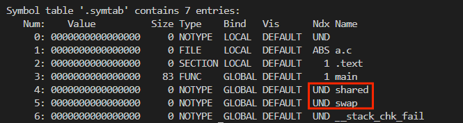
可以看到，这两个符号的Ndx属性是UND，就是undefined，即在当前文件没有该符号的定义。
再查看b.c目标文件中的符号表：
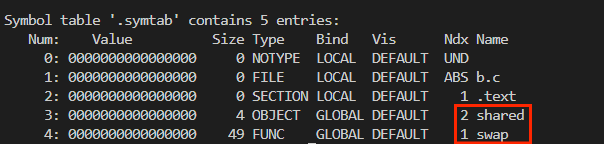
可以看到，shared和swap是存在于b.o中的
将a.o和b.o链接生成一个目标文件：ld a.o b.o -e main -o ab
-e main指定链接后程序的入口是main函数，-o ab表示链接后的文件名。
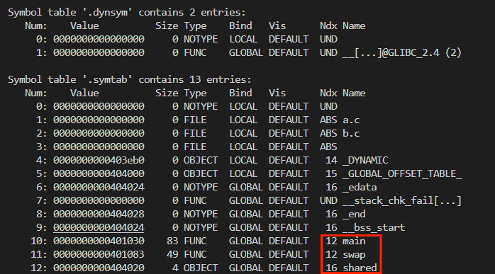
可以看到，main、share、swap三个符号都有，并且不再是UND。

#### 链接规则
将a.o和b.o相同的段进行合并
以.text段为例：
objdump -h a.o 查看节(section)信息

a.o的.text段大小为53
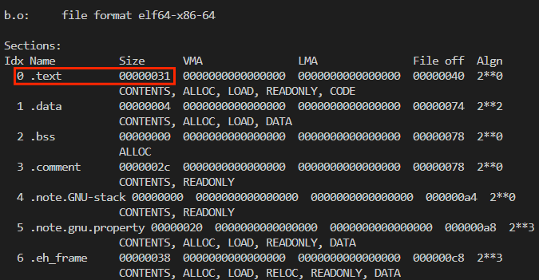
b.o的.text段大小为31
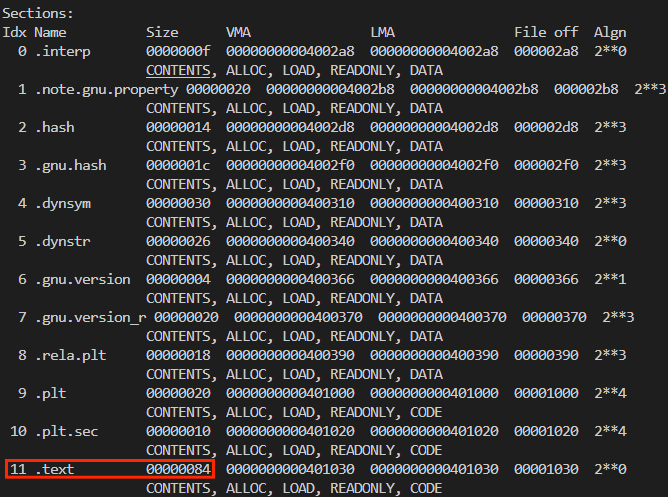
ab的.text段大小为84，得到验证
#### VMA和File off
表示段地址的两个角度：
File off:各个段在目标文件中的偏移量
VMA：各个段加载到内存时的虚拟内存地址

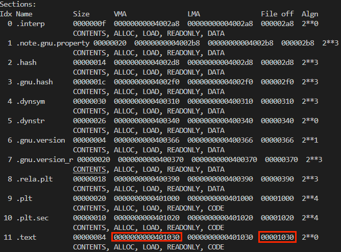
可以看出.text段在文件中偏移和VMA的区别。
在链接时，不光是计算出各个段的File off，同时也计算出各个段在加载到内存时的VMA，为执行文件做好了准备

#### 符号的虚拟地址
链接完成后，所有符号的虚拟地址就已经确定了
在链接前，各个符号在各自目标文件中相应段内的偏移是固定的。以swap为例
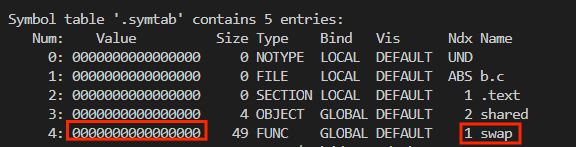
swap在b.o的.text段的开始位置。
在链接时，a和b的text段会合并，a的text段会在b的text段之前，如下所示：
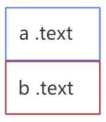
a.o的text段大小是53，如下图所示：

合并后的text段的虚拟内存地址是401030,如下图所示：
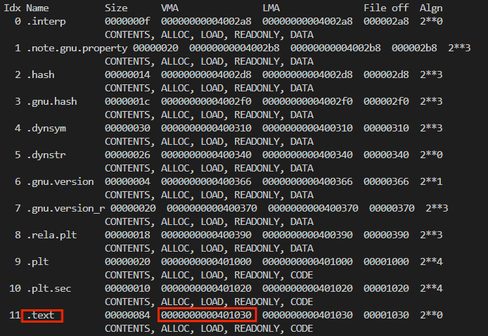
401030+53=401083，这个地址就是b.o的text段的位置，又因为swap在b.o的text中偏移量是0，所以可知：401083就是swap的虚拟内存地址。
objdump -d ab 查看ab的反汇编代码
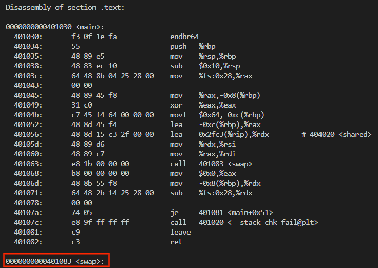
这样就找到相应符号的定义的位置，其他的符号都可以用同样的方法计算出来。
#### 重定位

首先，看看a.o的指令段中是如何调用swap函数的：
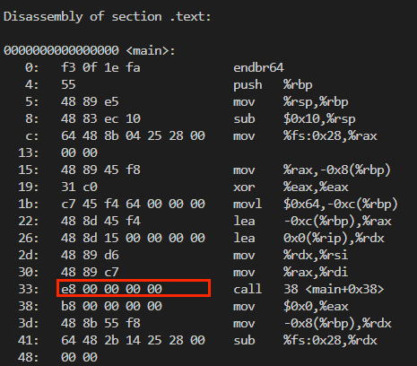
e8是call指令，它后面的4个字节，是要**调用的函数指令相对call下一条指令的偏移量**
这里是00 00 00 00,这个值是无意义的，因为在链接前，还不知道swap的虚拟内存地址。

然后我们来看ab文件中，上面的call指令中的地址部分：
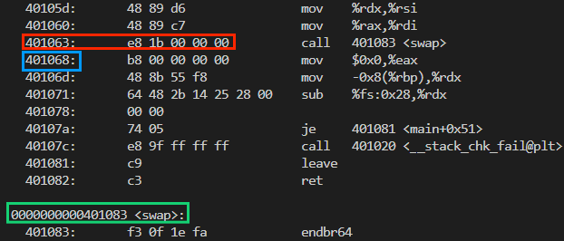
红色框部分就是那条e8指令，后面的地址变成了00 00 00 1b(小端)
call指令的下一条指令地址是蓝色框中的401068
401068+1b=401083,这正好是swap的地址，如图中绿框所示。
这就是重定位。对指令中涉及的符号引用，在链接后，根据符号的虚拟地址，进行调整

#### 重定位表
- 链接器如何知道哪些指令的地址需要调整？——重定位表(Relocation Table)

答案就是有一个重定位表，专门记录这些信息。

- 对于可重定位的ELF文件来说，它必须包含重定位表，用来描述如何修改相应的节的内容。对于每个要被重定位的ELF节都有一个对应的重定位表。如果.text节需要被重定位，则会有一个相对应叫.rel.text的节保存了代码节的重定位表；如果.data节需要被重定位，则会有一个相对应的.rel.tdata的节保存了数据节的重定位表。我们来看看a.o中的重定位表：objdump -r a.o

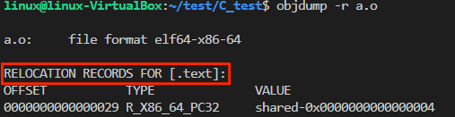

- OFFSET：0000000000000029:这是目标文件中需要修改的指令的偏移地址。在这个例子中，它指向 .text 段内的某个位置。
- TYPE：R_X86_64_PC32:这是重定位类型，R_X86_64_PC32 表示这是一个 32 位的 PC 相对偏移重定位。这种类型的重定位通常用于位置无关代码（PIC）或在静态链接中处理跳转指令。
- VALUE：shared-0x0000000000000004:这是重定位的值，它表示要跳转到的符号（在这个例子中是 shared）的地址减去 4。shared 是符号的名称。-0x4 是一个加到符号地址上的加数（addend），它用于调整跳转指令
重定位表记录了符号引用的位置，指明了在段中的偏移量及修改方式，确保程序加载时地址能正确调整


## 动态链接(Dynamic Link)
### 基本概念：
>动态链接是指将程序在运行时所需的代码片段从库文件中加载到内存，并在程序执行时完成链接的技术。
动态链接的基本概念
- 共享库（Shared Libraries）：也称为动态库，包含可由多个程序共享的代码和资源的文件。在Linux系统中，共享库通常以.so（Shared Object）为文件扩展名。

- 动态加载（Dynamic Loading）：程序在运行时，根据需要加载共享库。这意味着不是所有的库函数都在程序启动时加载，而是在实际调用时才加载到内存中。

- 动态链接器（Dynamic Linker）：也称为运行时链接器，它是一个特殊的程序，负责在程序执行时处理共享库的加载、符号解析和重定位。

----

- **动态链接的基本概念：**
   - 共享库（Shared Libraries）：也称为动态库，包含可由多个程序共享的代码和资源的文件。在Linux系统中，共享库通常以`.so`（Shared Object）为文件扩展名。

   - 动态加载（Dynamic Loading）：程序在运行时，根据需要加载共享库。这意味着不是所有的库函数都在程序启动时加载，而是在实际调用时才加载到内存中。

   - 动态链接器（Dynamic Linker）：也称为运行时链接器，它是一个特殊的程序，负责在程序执行时处理共享库的加载、符号解析和重定位。

----

```c
//program1.c
#include "lib.h"

int main()
{
    print_value(1);
    return 0;
}
```

```c
//program2.c
#include "lib.h"

int main()
{
    print_value(2);
    return 0;
}
```
----

```c
//lib.h
#ifndef LIB_H
#define LIB_H

void print_value(int i);

#endif
```

```c
//lib.c
#include <stdio.h>
void print_value(int i) 
{
    printf("%d\n", i);
}
</font>
```

----
- 将lib.c编译成共享对象文件：`gcc -fPIC -shared -o lib.so lib.c`
   - shared:指示编译器生成一个共享库
   - fPIC:"Position Independent Code",指示编译器生成可以在内存中的任何位置运行的代码，而不是假设代码将被加载到某个特定的地址,支持多个进程之间的共享和动态链接。
- 编译program1.c与program2.c
   - gcc -o program1 program1.c ./lib.so
   - gcc -o program2 program2.c ./lib.so

----

|  | 静态链接 | 动态链接 |
| --- | --- | --- |
| **链接时机** | 编译时 | 运行时 |
| **链接方式** | 将所有需要的库函数和数据直接嵌入到可执行文件中 | 仅在需要时从外部库中加载所需的函数和数据 |
| **可执行文件大小** | 通常较大，因为包含了所有依赖的库代码 | 较小，因为不包含库代码，只包含引用和路径 |
| **内存使用** | 如果多个程序静态链接了相同的库，每个程序都会在内存中保持其拷贝的副本，可能导致资源浪费 | 多个运行中的程序可以共享同一份库的副本，节省内存 |
| **更新和维护** | 更新库时需要重新编译和部署整个应用程序 | 更新库后，所有使用该动态库的应用程序无需重新编译，只需重新启动即可使用新的库版本 |
| **依赖性** | 不依赖于外部库文件，减少了依赖性问题 | 依赖于外部库文件，可能存在兼容性问题和安全性问题 |
| **性能** | 程序启动时可能更快，因为所有需要的代码都已加载 | 启动时可能需要加载外部库，导致启动稍慢 |
| **应用场景** | 适用于对独立性、安全性和稳定性要求较高的场景 | 适用于需要频繁更新、内存和存储资源有限、或支持模块化开发的场景 |


