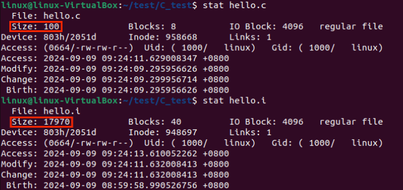
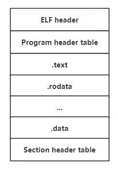

----
marp: true
----
# 目录
- 编译过程概览
- 准备工作
- 预处理
- 编译
- 汇编
- 链接
----
# 编译过程概览


----

# 准备工作
**编译工具：GCC(GNU Compiler Collection)，包含GCC、Binutils、C运行库等**
**Binutils**：一组二进制程序处理工具，包括：ar、objdump、as、ld、ldd、readelf、size等

----

|工具|作用|
|---|---|
|ar|主要用于创建、修改以及从静态库中提取文件|
|objdump|主要功能是将二进制代码转换为汇编代码|
|as|主要用于汇编。它将汇编语言源代码（.s文件）转换成机器语言的目标代码（.o文件）|
|ld|链接器|
|ldd|列出可执行文件或共享库所依赖的其他共享库|
|readelf|用于查看ELF（Executable and Linkable Format）格式文件的信息，如文件头、段（section）信息、符号表等。|


----

**演示代码**：
```
#include <stdio.h>
#define VAR 1

int main()
{
    int b=VAR;
    printf("hello world!\n");
    return 0;
}
```
----
# 预处理
## 命令：
```gcc -E hello.c -o hello.i```

## 主要过程:
- 移除#define指令，替换所有的宏定义，并且根据条件预编译指令(如#if、#ifdef、#ifndef等)包含或排除相应的代码段
- 处理#include预编译指令，将被包含的文件插入到该预编译指令的位置
- 删除所有注释("//"和"/* */")
----
## 查看hello.i文件
**命令：cat hello.i**
```
//hello.i代码片段
extern void funlockfile (FILE *__stream) __attribute__ ((__nothrow__ , __leaf__));

# 885 "/usr/include/stdio.h" 3 4
extern int __uflow (FILE *);
extern int __overflow (FILE *, int);
# 902 "/usr/include/stdio.h" 3 4
# 2 "hello.c" 2
# 5 "hello.c"

int main()
{
 int a=1;
 printf("hello world!\n");
 return 0;
}
```
----
<!--
_class: lead gaia
_paginate: false
-->


----

# 编译
> 将经过预处理之后的.i文件进行一系列的语法分析、语义分析及代码优化后生成相应的汇编代码
## 命令
```gcc -S hello.i -o hello.s```
## 主要任务
- 词法分析：将源代码分割成一系列的标记，如关键字、标识符、运算符等
- 语法分析：根据语法规则来分析由词法分析生成的标记序列，构建一颗语法树。这棵树表示了程序的语法结构
- 语义分析：检查语义正确性，包括类型检查、作用域检查等
- 代码优化：对代码进行多种优化，提高程序的执行效率

----

## 查看hello.s文件
```
//hello.s代码片段

main:
.LFB0:
	.cfi_startproc
	endbr64
	pushq	%rbp
	.cfi_def_cfa_offset 16
	.cfi_offset 6, -16
	movq	%rsp, %rbp
	.cfi_def_cfa_register 6
	subq	$16, %rsp
	movl	$1, -4(%rbp)
	leaq	.LC0(%rip), %rax
	movq	%rax, %rdi
	call	puts@PLT
	movl	$0, %eax
	leave
	.cfi_def_cfa 7, 8
	ret
	.cfi_endproc
```
----

<!--
_class: lead gaia
_paginate: false
-->


----

# 汇编
> 汇编过程实际上指把汇编语言代码翻译成目标机器指令的过程，这一步产生的文件叫做目标文件，是ELF(Executable and Linkable Format)格式的可重定向文件。
----
## ELF的文件格式
](https://terenceli.github.io/assets/img/elf/2.png)

- ELF header：描述体系结构和操作系统等基本信息，指出section header table和program header table在文件的位置
- program header table，这个是从运行的角度来看ELF文件的，主要给出了各个segment的信息
----
- text：已编译程序的指令代码段。

- .rodata：ro代表read only，即只读数据（如常数const）。

- .data：已初始化的C程序全局变量和静态局部变量。

- .bss：未初始化的C程序全局变量和静态局部变量。

- .debug：调试符号表，调试器用此段的信息帮助调试。
- .symtab：一个符号表（symbol table），它存放程序中被定义和引用的函数和全局变量的信息
- section header table，这个保存了所有的section的信息

----

## 指令
``` gcc -c hello.s -o hello.o```

## 主要任务
- 翻译汇编指令：汇编器(Binutils中的as)读取汇编代码，并将其中的每一条汇编指令翻译成对应的机器指令。这些机器指令是计算机硬件能够直接识别和执行的低级代码。
- 地址分配：在汇编过程中，汇编器还会为程序中的变量、函数等分配内存地址。这些地址在程序运行时用于访问和操作相应的数据或执行相应的函数。

----

## 查看hello.o文件
> 由于hello.o目标文件为ELF格式的文件，不能当做普通文本文件打开，想要查看需要使用反汇编的方法

**命令：objdump -d hello.o**

objdump：反汇编器

----

```
hello.o:     file format elf64-x86-64
Disassembly of section .text:
0000000000000000 <main>:
 //PC地址  指令编码                指令的汇编格式
   0:	f3 0f 1e fa          	endbr64 
   4:	55                   	push   %rbp
   5:	48 89 e5             	mov    %rsp,%rbp
   8:	48 83 ec 10          	sub    $0x10,%rsp
   c:	c7 45 fc 01 00 00 00 	movl   $0x1,-0x4(%rbp)
  13:	48 8d 05 00 00 00 00 	lea    0x0(%rip),%rax        # 1a <main+0x1a>
  1a:	48 89 c7             	mov    %rax,%rdi
  1d:	e8 00 00 00 00       	call   22 <main+0x22>
  22:	b8 00 00 00 00       	mov    $0x0,%eax
  27:	c9                   	leave  
  28:	c3                   	ret

```

----

# 链接
> 将编译生成的目标文件(.o 文件)与库文件等组织起来，形成最终的可执行文件
## 静态链接(Static Link)
### 原理：
在编译时期，链接器将程序所需的库文件(如标准库、第三方库等)的内容复制到可执行文件中，合并成一个单独的可执行文件。在这个过程中，链接器会解析目标代码中的符号引用(函数名、全局变量名等)，将库文件中的代码和数据直接复制到可执行文件中，替换原来的符号引用。

----

### 步骤
**1.地址空间分配：**
在静态链接的开始阶段，链接器需要为可执行文件中的各个部分（如代码段、数据段、堆栈段等）分配内存地址空间。这一步骤是后续重定位的基础，它确定了程序中各个段在内存中的起始地址。
**2.符号解析：**
确保程序中引用的所有符号(如函数和变量)都能正确找到它们的定义
**3.重定位：**
链接器（Linker）将多个编译后的目标文件（.o 文件）合并成一个可执行文件时的一个重要步骤。重定位的目的是确定程序中每个符号（如函数、变量等）的运行时内存地址，并修改对这些符号的引用，使之指向正确的地址

----

举例：当我们在一个源文件中调用另一个源文件中定义的函数时，编译器会在调用处生成一个符号引用（通常是函数名）。在链接过程中，链接器会找到这个函数的定义，并确定它在可执行文件中的地址。然后，链接器会修改调用处的指令，将函数名替换为这个函数在内存中的实际地址。


----

## 动态链接(Dynamic Link)
### 原理：
>动态链接是指在编译或链接阶段，不将程序所需的所有库代码直接包含到可执行文件中，而是在程序运行时，根据需要加载这些库。这种方式允许可执行文件保持较小的体积，并能够在不重新编译整个程序的情况下更新库文件。

----

## 优缺点对比


|维度	|静态链接	|动态链接|
|---|---|---|
|文件大小	|较大	|较小
|内存使用	|每个程序独立副本，可能浪费	|多程序共享副本，节省内存
|更新和维护	|需要重新编译整个程序	|只需更新库文件，无需重新编译程序
启动速度	|可能较快（无需加载外部库）	|可能较慢（需要加载外部库）
灵活性	|较低，编译时确定所有依赖	|较高，运行时可根据需要加载不同库


