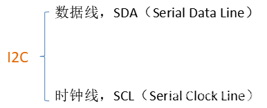
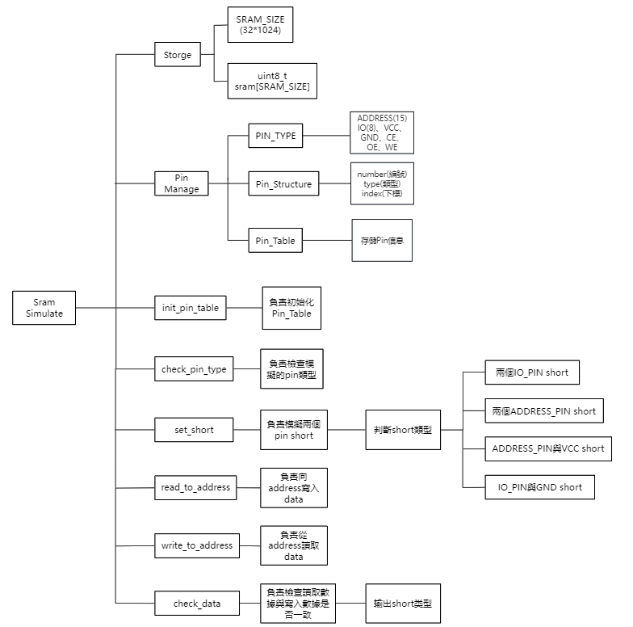
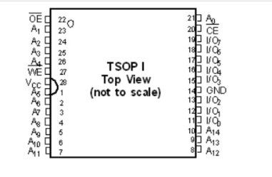
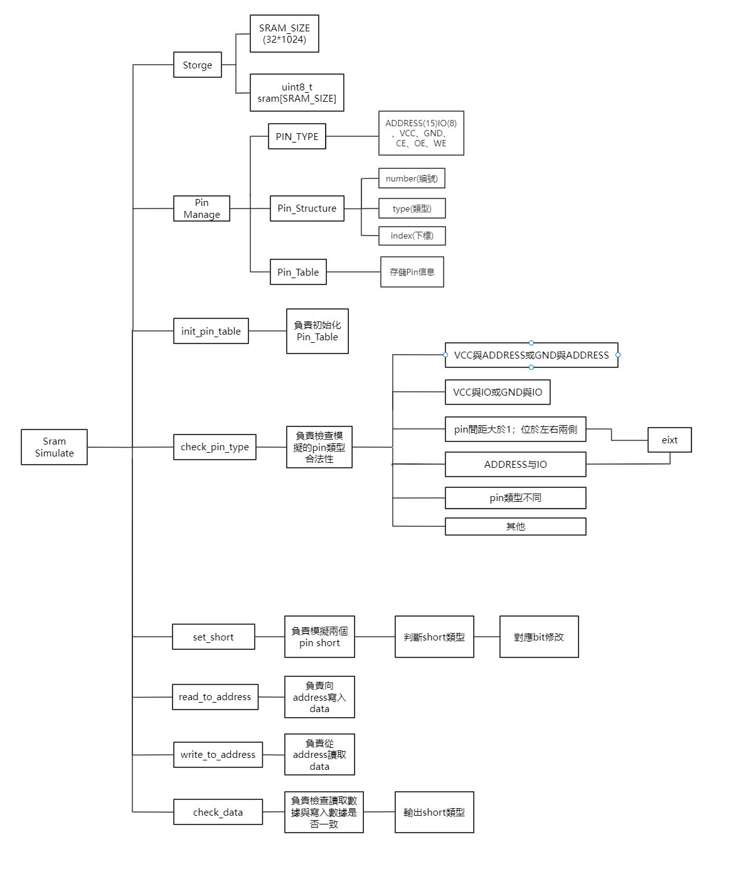

# 嵌入式开发流程
   ## 需求分析
   - 与客户沟通，确定产品的功能需求、性能需求、编写设计说明书
   ## 系统设计
   - 硬件设计：选择适当的硬件，如芯片、cpu、板子等
   -  软件设计：操作系统的选择、驱动程序的开发等
   ## 软件编码开发
   - 编写程序，功能模块代码编写、系统构建、驱动程序编写等
   ## 系统集成
   - 将开发好的软件和硬件进行集成，确保软件和硬件可正常协调工作
   - 将编译的内核映像烧录到开发板
   ## 测试
   - 对系统进行全面的测试，包括功能测试、性能测试、稳定性测试等
# 嵌入式系统的启动流程
  ## 系统上电
  ## 执行Bootloader(两个阶段)
   **cpu执行存储在Flash或ROM中的第一段Bootloader程序**
   - 1.负责初始化硬件设备，如CPU寄存器、Flash、DDR等，
   - 2.为加载第二段bootloader程序准备RAM空间
   - 3.将第二段bootloader加载到SDRAM中
   - 4.跳转到第二段bootloader程序的入口地址，将控制权交给第二段bootloader程序
   **执行第二段bootloader**
   - 初始化本阶段用到的硬件设备
   - 建立内存映射
   - 将内核映像和根文件系统映像从Flash加载到RAM中
    - 为内核设置启动参数，引导Linux内核启动
   ## 内核启动
   - 挂载根文件系统
   - 查找根文件系统中是否含有init文件，并执行init程序
   - init程序负责系统初始化、启动系统服务等
   - 挂载其他文件系统
# 串口通信协议
## I2C
### 简介：
> I2C(Inter-Integrated Circuit),也叫集成电路总线，`是一种同步、双向、双线的串口通信协议`，多用于`主控制器和从器件`之间的通信，I2C通信只需要两根线，一根是`数据线SDA`，一根是`时钟线SCL`。

### 硬件层面
> I2C有两条总线，一条双向的串行数据线SDA，一条串行时钟线SCL
- SDA(Serial data):串行数据线，用来传输数据
- SCL(Serial clock line):时钟线，用来控制数据发送的时序。
- 这两根线分别通过上拉电阻连接到电源。

> 所有接到I2C总线上的设备的SDA线都接到总线的SDA上，各设备的时钟线SCL都接到总线的SCL上。I2C总线上的每一个设备都有一个唯一的地址，以确保不同设备之间的访问互不干扰。

**I2C是多主从架构，每个设备都有唯一的地址，一个主设备理论上可以接127个从设备，设备的SDA并接在一起，SCL并接在一起。**

>I2C总线内部都是采用`漏极开路驱动(Open Drain)`,如图，栅极给电压时mos导通，输出低电平，栅级给0时mos关断输出呈高阻态，那么这里就无法输出高电平。

>加上上拉电阻后可以实现高低电平的输出：开关断开时电阻趋于无穷，电流为0，电源电压为输出电压，即输出高电平；开关闭合，输出低电平。只要有一个设备拉低总线电平，总线的电平就会被拉低，这就是`线与`功能，便与数据的传输和仲裁。

### 主从设备功能和职责
#### I2C主设备(master)
- 1.产生时钟(SCL):主设备负责控制SCL线的电平变化，以产生时钟信号。这个时钟信号用于同步主设备和从设备之间的数据传输。在每个周期内，SDA线上的数据状态被稳定地传输，并在SCL的某个边缘被采样。
- 2.产生起始信号：通信开始时，主设备通过将SDA线从高电平拉至低电平(同时SCL线为高电平)来产生一个起始信号。这个信号标志着数据传输的开始，并通知所有I2C总线上的设备开始准备接收或发送数据。
- 3.产生结束信号：数据传输结束时，主设备通过将SDA线从低电平拉至高电平(同时SCL线为高电平)来产生一个结束信号。这个信号标志着数据传输的结束，并允许总线再次进入空闲状态。
- 4.发送数据：主设备负责向从设备发送数据。数据按位发送，从最高位到最低位依次进行。每发送一个字节后，主设备会等待从设备的应答信号(ACK)
- 5.接收数据：在某些情况，主设备也会从从设备接收数据。这通常发生在主设备发送了一个读命令给从设备之后。
## UART
## SPI
## open drain(开漏)
### 定义和原理
- Open Drain，即开漏输出，是一种特殊的电路输出方式。在这种方式下，输出端口可以被接地拉低，但不能直接由电源拉高。它通常用于数字信号处理中，特别是在需要多个设备共享同一信号线的情况下
- 当输出信号为逻辑低电平时，输出端接地；当输出信号为逻辑高电平时，输出端呈现高阻态，相当于一个断路。
### 特点
- 需要外部上拉电阻：为了输出高电平，open-drain输出需要外接一个上拉电阻
- 电平转换方便：由于输出电平完全由上拉电阻连接的电源电平决定，open-drain可以很方便的进行电平转换
- 允许多个设备共享信号线：在多个设备共享同一信号线的情况下，只要有一个设备将信号线拉低，整个信号线就会呈现低电平状态，这种特性称为“线与”功能。 
## push-pull(推挽)
### 定义和原理
- push-pull输出模式是两个互补的晶体管(MOSFET)组成，这两个晶体管在电路中交替导通和截止，提供稳定的输出电平
- 当一个晶体管导通时，接电源，将输出端拉到高电平；当另一个晶体管导通时，接地，将输出端拉到低电平。
### 特点
- 切换速度块：由于晶体管的快速切换特性，push-pull输出通常具有较快的切换速度，适用于高速通信接口，如UART、SPI等
- 无需上拉电阻：push-pull输出能够直接提供高电平和低电平，无需外部上拉电阻
- 驱动能力强：两个晶体管交替工作，，Push-Pull输出能够提供较大的输出电流，适合驱动需要较高电流的负载，如电机、LED灯带等。
## MCU与SOC
### MCU
> MCU:中文名称为微控制单元，又称单片微型计算机（Single Chip Microcomputer）或单片机。它是一种集成了处理器、存储器、输入输出接口等多种功能模块于一体的小型计算机系统。
>SoC:全称为系统级芯片，是一种高度集成的电路，它不仅包含了传统MCU的功能，还集成了更多的系统组件，如完整的操作系统、高性能处理器（如CPU、GPU）、多媒体处理单元、网络接口等。

## RTOS
## Git
 