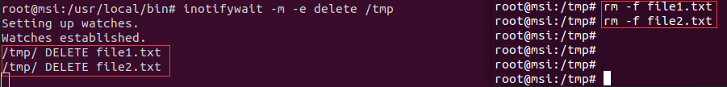

### 1. inotify监控/dev
- usb_monitor.sh(监控脚本)
- usb_middleware.sh(提示通知脚本)
#### 监控脚本功能
- 通过 inotifywait 监控 /dev 目录下的节点创建事件
- 挂载usb设备到/mnt/usb
- 通过匿名管道fifo通知middleware
#### middleware功能
- 接收usb_monitor.sh通知
- 提示usb插入消息
### 2.udev方案
1. 通过udev规则，当插入U盘时，触发udev规则，调用usb_monitor.sh，该脚本负责挂载和通知middleware。
2. 配置udev规则，在/etc/udev/rules.d/99-usb.rules中添加如下内容：
```c
# /etc/udev/rules.d/99-usb-mount.rules
# USB设备插入
KERNEL=="sd[a-z][0-9]", SUBSYSTEM=="block", ACTION=="add", \
ATTRS{idVendor}=="0951", RUN+="/usr/local/bin/usb-mount.sh add %k"

# USB设备移除
KERNEL=="sd[a-z][0-9]", SUBSYSTEM=="block", ACTION=="remove", \
RUN+="/usr/local/bin/usb-mount.sh remove %k"
```


### U盘设备的命名格式
在Linux系统中，u盘插入时，会被识别为scsi块设备，其设备名以sd开头，如sdb、sdb1、sdb2等。

**格式：**/dev/sd[a-z][1-9]
例如：
- /dev/sdb :整个u盘设备
- /dev/sdb1:u盘的第一个分区
### SCSI
SCSI是一种标准接口，用于连接计算机及其外部存储设备，如磁盘、光驱、U盘等。

### inotifywait介绍
inotifywait是Linux中的一个命令行工具，用于实时监控文件系统中的文件或目录的变化。它基于inotify(inode notify)系统调用，允许程序对文件或目录的创建、删除和修改等操作进行实时监控并做出反应。在内核2.6.6.13版本之后就支持了inotify。
### 安装
sudo apt-get install inotify-tools
### 常见用法和参数
1.基本语法：
`inotifywait [options] path`
2.常用选项：
-m:保持进程持续允许，持续监听文件或目录
-e:指定监控的事件类型，如：create、delete、modify等
-r:递归及监控目录及其子目录
-t:设置超时时间，超过指定时间后自动退出
3.常见事件类型：
- create：创建文件或目录
- delete：删除文件或目录
- modify：修改文件内容
- move：移动文件或目录
- attrib: 修改文件属性
### 使用示例
#### 1.监控文件修改:
监控/tmp目录下文件的创建事件：

#### 2.监控文件删除:
监控/tmp目录下文件的删除事件：



Systemd 服務概述：
    系统服务（System Service）是在操作系统后台持续运行的守护进程（Daemon），它们随系统启动而自动运行，不需要用户交互，主要用于执行特定的系统任务或提供特定的系统功能。在 Linux 系统中，这些服务通常由 systemd 进行管理，可以通过 systemctl 命令进行启动、停止、重启等操作，并且具有自动恢复、依赖管理、日志记录等特性。
自动化管理
- 开机自启动
- 故障自恢复
- 优雅关闭
可靠性保证
- 状态监控
- 自动重启
- 依赖管理
统一日志管理
- 集中收集
- 统一格式
- 便于查询
使用系统服务可以实现对进程的自动化管理，包括开机自启动、故障自动恢复和优雅关闭等功能；同时通过 systemd 的监控机制，提供了进程运行状态的实时监控和自动重启等可靠性保证；此外，所有服务的日志都被 systemd-journald 统一收集和管理，方便进行问题诊断和系统维护。
        

### udev

devfs 和 hotplug 是 Linux 系统中早期用于设备管理的两个组件
devfs 是一个虚拟文件系统，用于管理和提供设备文件的动态创建和删除
hotplug 是一个机制，用于在设备插入或移除时自动执行特定的操作.它允许系统在硬件变化时动态响应。


### udev规则文件：
/etc/udev/rules.d 优先级最高  ：这些规则文件由系统管理员或用户创建，用于覆盖或扩展系统默认的规则
/run/udev/rules.d/ 次之   目录中的规则文件是系统运行时动态生成的或临时放置的，这些目录中的规则文件由系统发行版或软件包管理器提供，包含系统默认的设备规则
/lib/udev/rules.d  与/usr/lib/udev/rules.d 同优先级  这些目录中的规则文件由系统发行版或软件包管理器提供，包含系统默认的设备规则。
/usr/lib/udev/rules.d

  /lib/udev/rules.d 通常是 /usr/lib/udev/rules.d 的符号链接
  /lib/udev/rules.d -> /usr/lib/udev/rules.d
同名规则文件时，高优先级目录中的规则会覆盖低优先级目录中的规则

### udev工作原理
tips:uevent是内核提供的一种机制，用于通知用户空间有关硬件设备状态变化的事件

udevd是udev的用户空间守护进程，它负责监听来自内核的设备事件，并根据udev规则来处理这些事件。

1. 设备事件触发
如：当内核检测到硬件设备被添加或移除时（例如，一个USB设备被插入或拔出），内核会生成一个uevent事件。
2. 内核通知
内核检测到新设备后，会创建相应的设备节点（如/dev/sdb）。
内核还会在sysfs文件系统中为设备创建一个目录，该目录包含了设备的各种属性和状态信息。
内核通过发送uevent消息到udev守护进程，通知系统有新设备插入。
3. udev守护进程
udev守护进程（udevd）监听/dev和sysfs中的变化。
当udev接收到uevent消息时，它会读取与设备相关的sysfs信息。
4. 规则匹配
udev根据接收到的uevent消息和sysfs中的信息，查找匹配的规则。
规则文件通常位于/etc/udev/rules.d/和/lib/udev/rules.d/目录下。
规则文件定义了如何处理特定类型的设备，包括创建或删除设备文件、设置设备权限、运行特定的脚本等。
5. 规则执行
一旦找到匹配的规则，udev会执行规则中定义的命令或操作。
规则可以指定设备文件的名称、权限、所有者、组等属性。
规则还可以指定在设备插入或移除时运行的脚本。
6. 设备文件管理
udev根据规则创建或更新/dev目录下的设备文件。
设备文件的名称、权限和所有者等属性由规则文件中的指令决定。
udev还可以创建符号链接，以便用户更容易地访问设备


在Ubuntu系统中，当U盘插入时自动挂载到/media目录下，主要使用的是udisks2

