----
    theme: white.css
    width: 960
    height: 700
    minScale: 0.2
    maxScale: 1.5
    controls: true
    transition: 'slide'
    mouseWhee: 'true'
----


<!-- slide -->

### 目录
----
<font size= 5>

- 编译过程概览
- 准备工作
- 预处理
- 编译
- 汇编
- 链接

</font>
<!-- slide -->

### 编译过程概览
----
<font size= 5>


</font>
<!-- slide -->
<font size= 5>

### 工具
----

- **编译工具：GCC(GNU Compiler -Collection)，包含GCC、Binutils、C运行库等**

- **Binutils**：一组二进制程序处理工具，包括：ar、objdump、as、ld、ldd、readelf、size等

</font>
<!-- slide -->
<font size= 5>

|工具|作用|
|---|---|
|ar|主要用于创建、修改以及从静态库中提取文件|
|objdump|主要功能是将二进制代码转换为汇编代码|
|as|主要用于汇编。它将汇编语言源代码（.s文件）转换成机器语言的目标代码（.o文件）|
|ld|链接器|
|ldd|列出可执行文件或共享库所依赖的其他共享库|
|readelf|用于查看ELF（Executable and Linkable Format）格式文件的信息，如文件头、段（section）信息、符号表等。|

</font>
<!-- slide -->

<center>

#### 演示代码:
----

```c {.line-numbers}
#include <stdio.h>
#define VAR 1

//打印“hello world"
int main()
{
    int b=VAR;
    printf("hello world!\n");
    return 0;
}
```
</center>
<!-- slide -->
<font size= 5>

### 预处理(Pcreprocessing)

----
- **命令：**
   - gcc -E hello.c -o hello.i

-  **主要内容:**
   - 移除#define指令，替换所有的宏定义，并且根据条件预编译指令(如#if、#ifdef、#ifndef等)包含或排除相应的代码段
   - 处理#include预编译指令，将被包含的文件插入到该预编译指令的位置
   - 删除所有注释("//"和"/* */")

</font>
<!-- slide -->
<font size= 6>


```c 
//hello.i代码片段
extern void funlockfile (FILE *__stream) __attribute__ ((__nothrow__ , __leaf__));

# 885 "/usr/include/stdio.h" 3 4
extern int __uflow (FILE *);
extern int __overflow (FILE *, int);
# 902 "/usr/include/stdio.h" 3 4
# 2 "hello.c" 2
# 5 "hello.c"

int main()
{
 int a=1;
 printf("hello world!\n");
 return 0;
}
```
</font>
<!-- slide -->
<font size= 6>

- .c文件经预处理后生成的.i文件大小显著增加
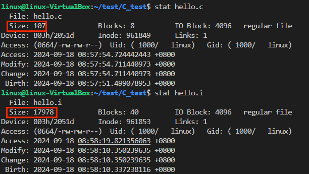

</font>
<!-- slide -->


### 编译(Compilation)
<font size= 5>

----
- **编译：** 将经过预处理之后的.i文件进行一系列的语法分析、语义分析及代码优化后生成相应的汇编代码
- **命令：**
    - gcc -S hello.i -o hello.s
- **主要内容：**
   - 词法分析：将源代码分割成一系列的标记，如关键字、标识符、运算符等
   - 语法分析：根据语法规则来分析由词法分析生成的标记序列，构建一颗语法树。这棵树表示了程序的语法结构
   - 语义分析：检查语义正确性，包括类型检查、作用域检查等
   - 代码优化：对代码进行多种优化(循环优化、冗余代码消除)，提高程序的执行效率

</font>
<!-- slide -->
<font size= 6>

```c
//hello.s代码片段
main:
.LFB0:
	.cfi_startproc
	endbr64
	pushq	%rbp
	.cfi_def_cfa_offset 16
	.cfi_offset 6, -16
	movq	%rsp, %rbp
	.cfi_def_cfa_register 6
	subq	$16, %rsp
	movl	$1, -4(%rbp)
	leaq	.LC0(%rip), %rax
	movq	%rax, %rdi
	call	puts@PLT
	movl	$0, %eax
	leave
	.cfi_def_cfa 7, 8
	ret
	.cfi_endproc
```
</font>
<!-- slide -->

### 汇编(Assembly)
----
<font size= 5>


- **汇编：** 指把汇编语言代码翻译成目标机器指令的过程，这一步产生的文件叫做目标文件，是ELF(Executable and Linkable Format)格式的可重定向文件。
- **指令：**
    - gcc -c hello.s -o hello.o

</font>
<!-- slide -->
<font size= 5>

- 主要任务
   - 翻译汇编指令：汇编器(Binutils中的as)读取汇编代码，并将其中的每一条汇编指令翻译成对应的机器指令。这些机器指令是计算机硬件能够直接识别和执行的低级代码。

</font>
<!-- slide -->
<font size= 5>

#### ELF的文件格式
----

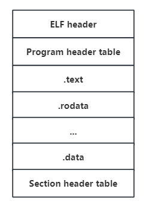](https://terenceli.github.io/assets/img/elf/2.png)

- ELF header：描述体系结构和操作系统等基本信息，指出section header table和program header table在文件的位置
- program header table，这个是从运行的角度来看ELF文件的，主要给出了各个segment的信息

</font>
<!-- slide -->
<font size= 5>

- .text：已编译程序的指令代码段。

- .rodata：只读数据。

- .data：已初始化的C程序全局变量和静态局部变量。

- .bss：未初始化的C程序全局变量和静态局部变量。

- .debug：调试符号表，调试器用此段的信息帮助调试。
- .symtab：一个符号表（symbol table），它存放程序中被定义和引用的函数和全局变量的信息
- section header table：保存了所有的section的信息

</font>
<!-- slide -->
<font size= 5>

- **查看hello.o文件**
   - hello.o目标文件为ELF格式的文件，不能当做普通文本文件打开

- **readelf:** 显示 ELF（Executable and Linkable Format）文件信息的工具
- **objdump:** 用于显示二进制文件信息。可以显示反汇编代码、符号表、重定位表等

</font>
<!-- slide -->
<font size= 6>

<p align="left"> 
查看符号表：readelf -s hello.o
</p>

```c
Symbol table '.symtab' contains 6 entries:
   Num:    Value          Size Type    Bind   Vis      Ndx Name
     0: 0000000000000000     0 NOTYPE  LOCAL  DEFAULT  UND 
     1: 0000000000000000     0 FILE    LOCAL  DEFAULT  ABS hello.c
     2: 0000000000000000     0 SECTION LOCAL  DEFAULT    1 .text
     3: 0000000000000000     0 SECTION LOCAL  DEFAULT    5 .rodata
     4: 0000000000000000    41 FUNC    GLOBAL DEFAULT    1 main
     5: 0000000000000000     0 NOTYPE  GLOBAL DEFAULT  UND puts
```
</font>

<font size= 4>

- Num:符号编号，用于唯一标识符号
- Value:对于函数和变量，这通常是它们在内存中的地址(在对象文件中，这通常是相对于段的偏移量)。在对象文件中，由于最终的内存地址尚未确定，这些值通常为0
- Size:符号的大小(以字节为单位)
- Type:符号的类型(FUNC、OBJECT、FILE、SECTION、NOTYPE)
- Bind:符号的绑定属性(指示符号的可见性和作用域)

- Vis:符号的可见性，通常与Bind字段一起使用
- Ndx:符号所在的段索引，未定义的外部符号通常是UND，对于特殊符号(如FILE和SECTION)可以是ABS或其他特殊值
- Name:符号的名称

</font>
<!-- slide -->
<font size= 5>
<p align="left"> 
查看代码段：objdump -d hello.o
</p>

<font size= 6>

```c
hello.o:     file format elf64-x86-64
Disassembly of section .text:
0000000000000000 <main>:
 //PC地址  指令编码              指令的汇编格式
   0:	f3 0f 1e fa          	endbr64 
   4:	55                   	push   %rbp
   5:	48 89 e5             	mov    %rsp,%rbp
   8:	48 83 ec 10          	sub    $0x10,%rsp
   c:	c7 45 fc 01 00 00 00 	movl   $0x1,-0x4(%rbp) //初始化局部变量
  13:	48 8d 05 00 00 00 00 	lea    0x0(%rip),%rax        # 1a <main+0x1a>
  1a:	48 89 c7             	mov    %rax,%rdi
  1d:	e8 00 00 00 00       	call   22 <main+0x22>  //函数调用
  22:	b8 00 00 00 00       	mov    $0x0,%eax
  27:	c9                   	leave  
  28:	c3                   	ret

```

</font>

- 注：这段汇编代码表示了main函数的执行流程，包括堆栈初始化、局部变量初始化、函数调用准备，返回值。

</font>
<!-- slide -->

### 链接(Linking)

<font size= 5>

----
- **链接：** 将编译生成的目标文件(.o 文件)与库文件等组织起来，形成最终的可执行文件

- **静态链接(Static Link)**

   - **原理：** 在编译时期，链接器将程序所需的库文件(如标准库、第三方库等)的内容复制到可执行文件中，合并成一个单独的可执行文件。在这个过程中，链接器会解析目标代码中的符号引用(函数名、全局变量名等)，将库文件中的代码和数据直接复制到可执行文件中，替换原来的符号引用。

</font>
<!-- slide -->

#### 步骤
<font size= 5>

- **1.地址空间分配：**
   - 链接器首先扫描所有输入的目标文件，收集它们的段信息，然后根据一定的策略（如按序叠加或相似段合并）将相同性质的段合并到一起。在合并的过程中，链接器为这些段分配虚拟地址，并建立映射关系
- **2.符号解析：**
   - 确保程序中引用的所有符号(如函数和变量)都能正确找到它们的定义

- **3.重定位：**

   - 链接器（Linker）将多个编译后的目标文件（.o 文件）合并成一个可执行文件时的一个重要步骤。重定位的目的是确定程序中每个符号（如函数、变量等）的运行时内存地址，并修改对这些符号的引用，使之指向正确的地址

</font>
<!-- slide -->


### 静态链接过程详解：
<font size= 5>

----
<p align="left">
a.c
</p>

```c
extern int shared;
void swap(int *a,int *b);
int main()
{
	int a=100;
	swap(&a,&shared);
}
```
<p align="left">
b.c
</p>

```c
int shared=1;
void swap(int *a,int *b)
{
    int tmp=*a;
    *a=*b;
    *b=tmp;
}
```
</font>
<!-- slide -->
<font size= 5>

- a.c文件引用b.c文件中的shared变量和swap函数。
- 对a.c文件进行编译，执行**gcc -c a.c -o a.o**得到a.o目标文件，使用**readelf -s a.o**查看符号表

- 查看b.o目标文件的符号表：


</font>
<!-- slide -->
<font size= 5>

- 将a.o和b.o链接生成一个目标文件：ld a.o b.o -e main -o ab
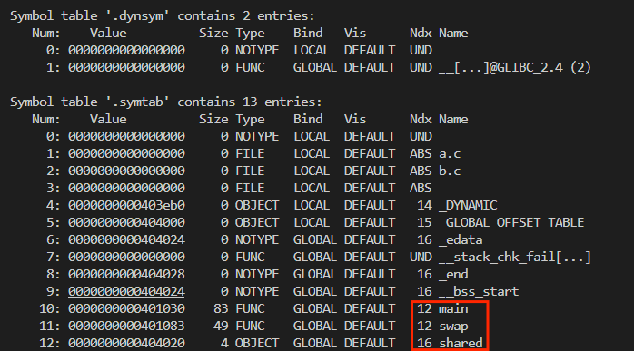

</font>
<!-- slide -->
<font size= 5>

- **链接规则:** 将a.o和b.o相同的段进行合并
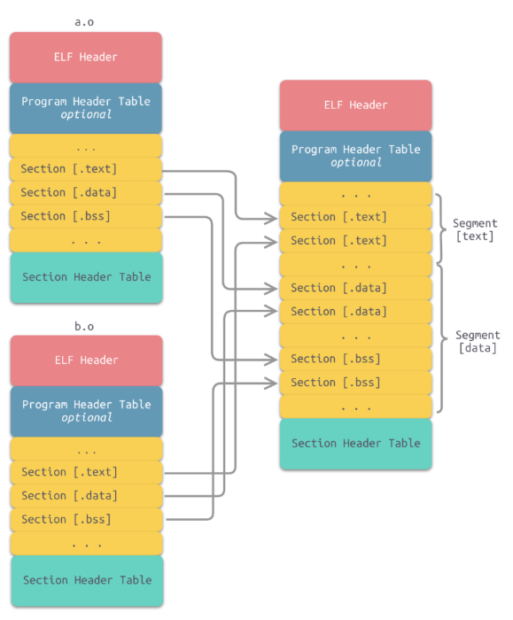

<!-- slide -->

- 以.text段为例：
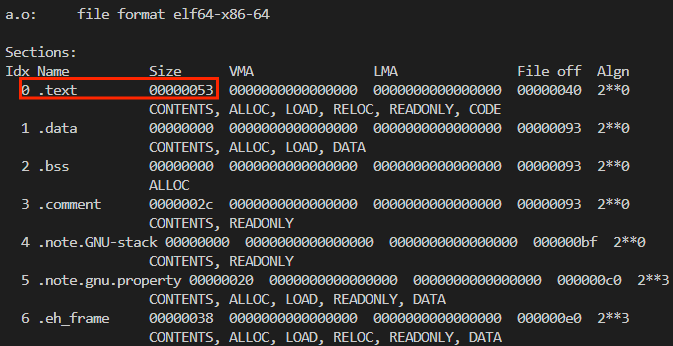
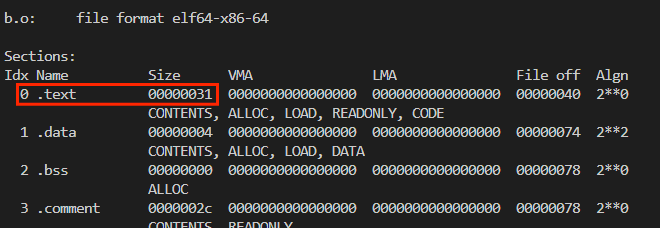


</font>
<!-- slide -->

<font size= 5>

- ab的.text段大小为84
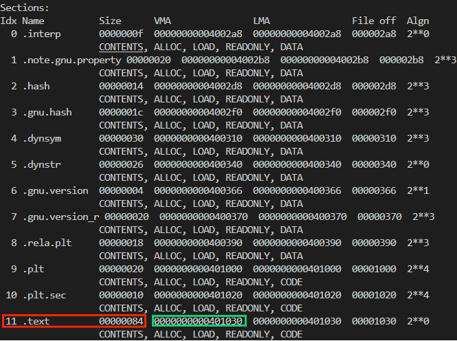

- File off:各个段在目标文件中的偏移量
- VMA：各个段加载到内存时的虚拟内存地址

</font>
<!-- slide -->

#### 符号解析
<font size= 5>

- 链接完成后，所有符号的虚拟地址就已经确定了
- 在链接前，各个符号在各自目标文件中相应段内的偏移是固定的。
   - 以swap函数为例


- swap在b.o的.text段的开始位置。在链接时，a和b的text段会合并，a的text段会在b的text段之前，如下图所示：

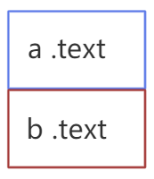

</font>
<!-- slide -->
<font size= 4>

- a.o的text段大小是53，如下图所示：

- 合并后的text段的虚拟内存地址是401030,如下图所示：
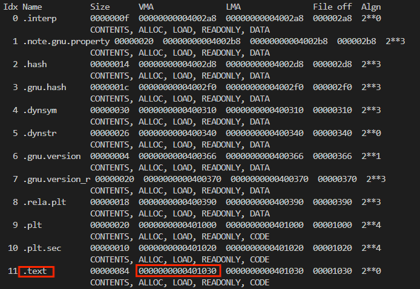
401030+53=401083，这个地址就是合并后b.o的text段的位置，又因为swap在b.o的text中偏移量是0，所以可知：401083就是swap的虚拟内存地址。

</font>
<!-- slide -->
<font size= 5>

- objdump -d ab 查看ab的反汇编代码
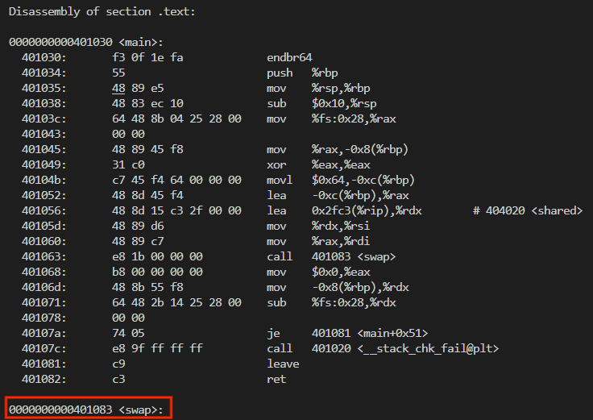

</font>
<!-- slide -->

#### 重定位
<font size= 5>

- 首先，看a.o的指令段中是如何调用swap函数的：
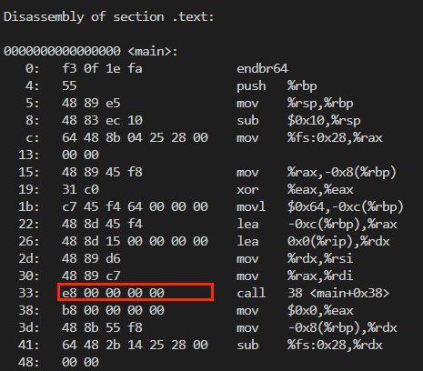
e8是call指令，它后面的4个字节，是**要调用的函数相对call下一条指令的偏移量**
</font>
<!-- slide -->

<font size= 5>

- ab文件中，上面的call指令中的地址部分：
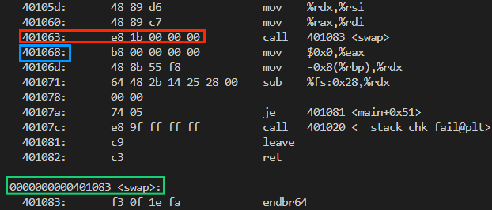
call指令的下一条指令地址是蓝色框中的401068
401068+1b=401083,这正好是swap的地址，如图中绿框所示。

</font>
<!-- slide -->

#### 重定位表
----
<font size= 5>

- 链接器如何知道哪些指令的地址需要调整？——重定位表(Relocation Table)
- a.o的重定位表：

- 重定位表记录了符号引用的位置，指明了在段中的偏移量及修改方式，确保程序加载时地址能正确调整

</font>
<!-- slide -->


#### 动态链接(Dynamic Link)
----
<font size= 5>

- **动态链接：** 是指将程序在运行时所需的代码片段从库文件中加载到内存，并在程序执行时完成链接的技术。
- **动态链接的基本概念：**
   - 共享库（Shared Libraries）：也称为动态库，包含可由多个程序共享的代码和资源的文件。在Linux系统中，共享库通常以`.so`（Shared Object）为文件扩展名。

   - 动态加载（Dynamic Loading）：程序在运行时，根据需要加载共享库。这意味着不是所有的库函数都在程序启动时加载，而是在实际调用时才加载到内存中。

   - 动态链接器（Dynamic Linker）：也称为运行时链接器，它是一个特殊的程序，负责在程序执行时处理共享库的加载、符号解析和重定位。

</font>
<!-- slide -->
<font size= 6>

```c
//program1.c
#include "lib.h"

int main()
{
    print_value(1);
    return 0;
}
```

```c
//program2.c
#include "lib.h"

int main()
{
    print_value(2);
    return 0;
}
```
</font>
<!-- slide -->
<font size= 6>

```c
//lib.h
#ifndef LIB_H
#define LIB_H

void print_value(int i);

#endif
```

```c
//lib.c
#include <stdio.h>
void print_value(int i) 
{
    printf("%d\n", i);
}
</font>
```

</font>

<!-- slide -->
<font size= 5>
- 将lib.c编译成共享对象文件：`gcc -fPIC -shared -o lib.so lib.c`
   - shared:指示编译器生成一个共享库
   - fPIC:"Position Independent Code",指示编译器生成可以在内存中的任何位置运行的代码，而不是假设代码将被加载到某个特定的地址,支持多个进程之间的共享和动态链接。
- 编译program1.c与program2.c
   - gcc -o program1 program1.c ./lib.so
   - gcc -o program2 program2.c ./lib.so

</font>
<!-- slide -->
<font size= 4>

|  | 静态链接 | 动态链接 |
| --- | --- | --- |
| **链接时机** | 编译时 | 运行时 |
| **链接方式** | 将所有需要的库函数和数据直接嵌入到可执行文件中 | 仅在需要时从外部库中加载所需的函数和数据 |
| **可执行文件大小** | 通常较大，因为包含了所有依赖的库代码 | 较小，因为不包含库代码，只包含引用和路径 |
| **内存使用** | 如果多个程序静态链接了相同的库，每个程序都会在内存中保持其拷贝的副本，可能导致资源浪费 | 多个运行中的程序可以共享同一份库的副本，节省内存 |
| **更新和维护** | 更新库时需要重新编译和部署整个应用程序 | 更新库后，所有使用该动态库的应用程序无需重新编译，只需重新启动即可使用新的库版本 |
| **依赖性** | 不依赖于外部库文件，减少了依赖性问题 | 依赖于外部库文件，可能存在兼容性问题和安全性问题 |
| **性能** | 程序启动时可能更快，因为所有需要的代码都已加载 | 启动时可能需要加载外部库，导致启动稍慢 |
| **应用场景** | 适用于对独立性、安全性和稳定性要求较高的场景 | 适用于需要频繁更新、内存和存储资源有限、或支持模块化开发的场景 |
</font>
